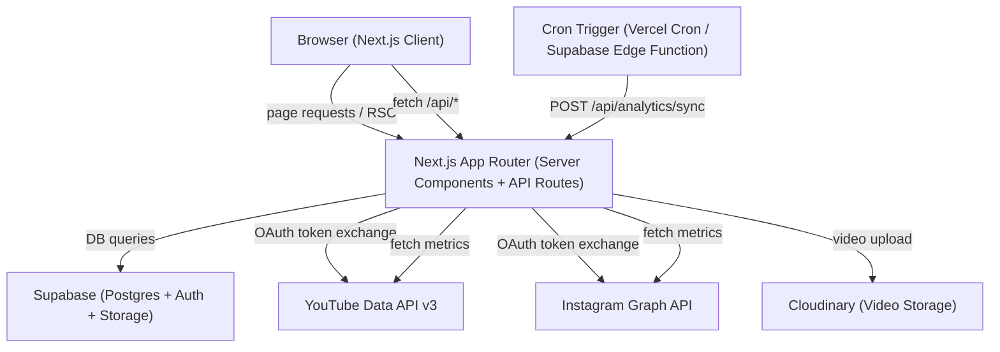
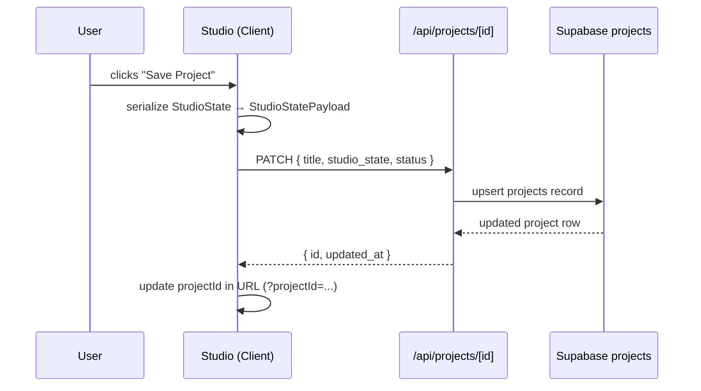
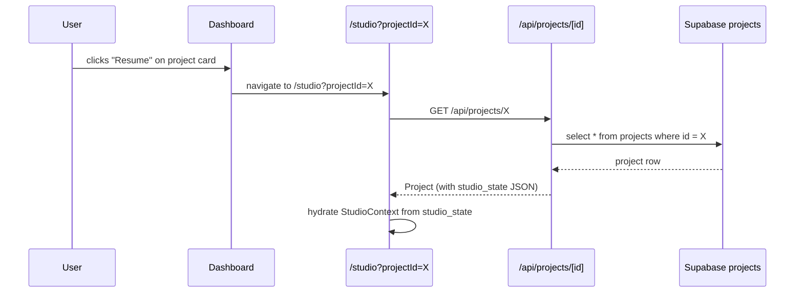
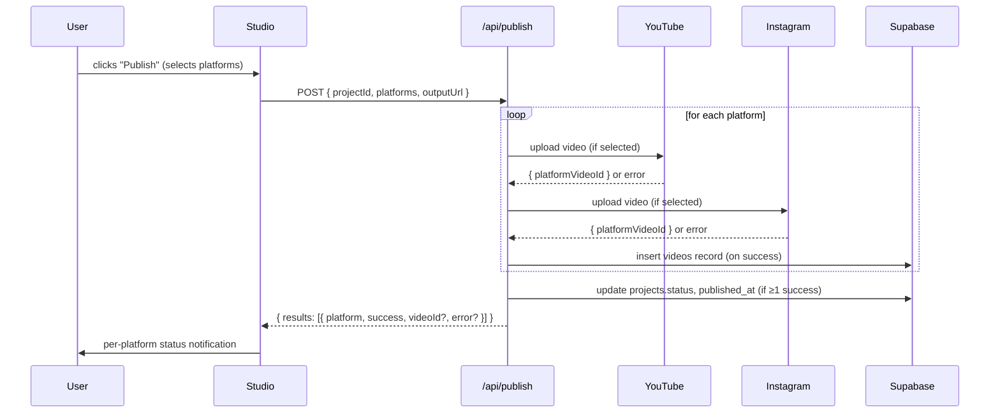
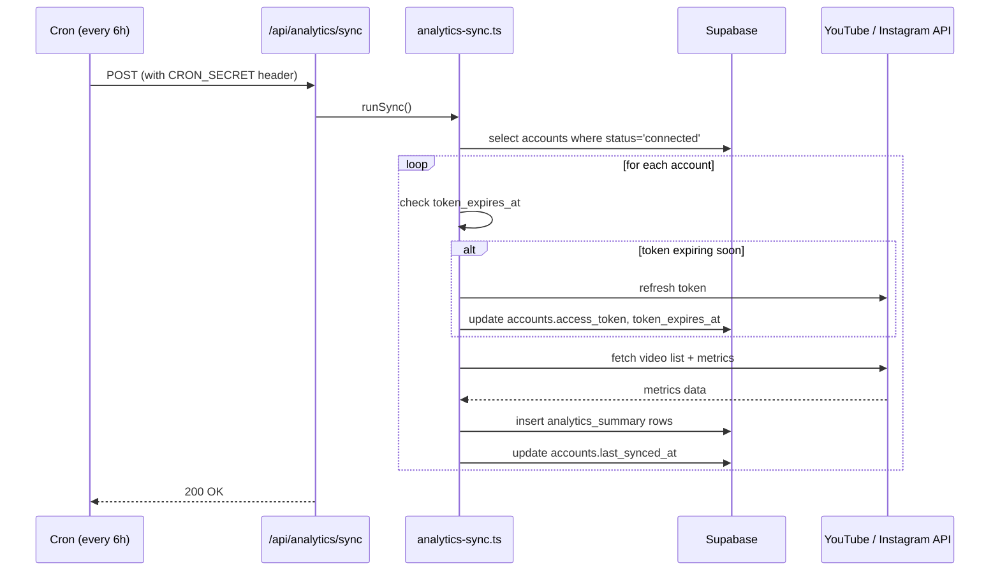
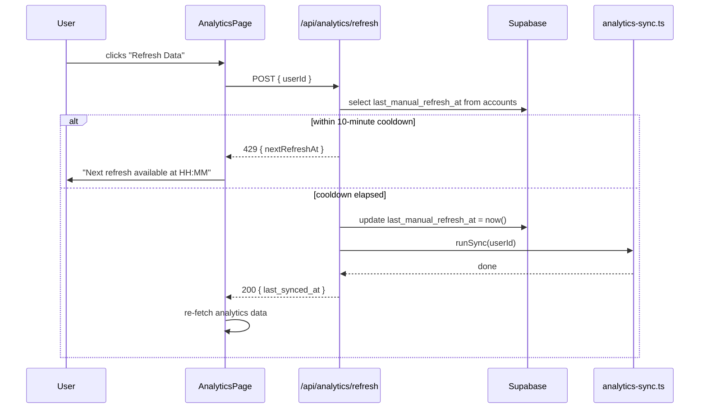
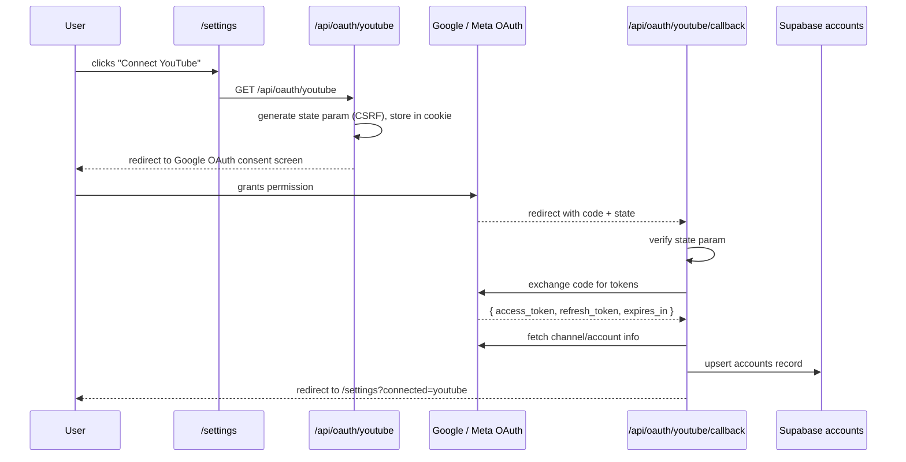

# Design Document: Creator Platform

## Overview

The Creator Platform transforms the existing faceless video tool into a full content creation hub. The core loop is: **Dashboard → Create (Studio) → Publish → Analytics → Dashboard**. The implementation is a Next.js 14 App Router application layered on top of the existing codebase, adding five new top-level routes, a Supabase-backed data layer, background analytics sync, and a phased OAuth integration for YouTube and Instagram.

Key design decisions:
- **Supabase as the single source of truth** for projects, videos, accounts, and analytics snapshots. No client-side localStorage for project state (the existing Kanban planner's localStorage usage is preserved only for the Planner's card ordering until migrated).
- **Mock/dev mode via `NEXT_PUBLIC_MOCK_ANALYTICS`** so all UI can be built and demoed without live API credentials.
- **Background sync via a Next.js API route + external cron** (Vercel Cron or Supabase Edge Function) rather than a long-running process, keeping the deployment serverless-compatible.
- **Rate limiting stored in Supabase** (`accounts.last_manual_refresh_at`) so the 10-minute cooldown survives across serverless function invocations.

---

## Architecture

### High-Level System Diagram



### Route Structure

```
src/app/
├── page.tsx                          → redirect to /dashboard
├── dashboard/
│   ├── page.tsx                      → Dashboard (Server Component)
│   ├── loading.tsx                   → Skeleton loaders for dashboard
│   └── error.tsx                     → Error boundary with retry
├── studio/
│   ├── page.tsx                      → Studio (Client Component, existing logic)
│   └── error.tsx                     → Error boundary with retry
├── planner/
│   └── page.tsx                      → Planner (relocated Kanban)
├── analytics/
│   ├── page.tsx                      → Analytics Overview
│   ├── loading.tsx                   → Skeleton loaders for analytics
│   ├── error.tsx                     → Error boundary with retry
│   └── [videoId]/
│       └── page.tsx                  → Per-Video Analytics
├── settings/
│   └── page.tsx                      → Settings / OAuth management
└── api/
    ├── analytics/
    │   ├── sync/route.ts             → Background sync endpoint (cron target)
    │   └── refresh/route.ts          → Manual refresh endpoint
    ├── projects/
    │   ├── route.ts                  → GET (list), POST (create)
    │   └── [id]/route.ts             → GET, PATCH, DELETE
    ├── publish/
    │   └── route.ts                  → Publish workflow
    └── oauth/
        ├── youtube/
        │   ├── route.ts              → Initiate YouTube OAuth
        │   └── callback/route.ts     → YouTube OAuth callback
        └── instagram/
            ├── route.ts              → Initiate Instagram OAuth
            └── callback/route.ts     → Instagram OAuth callback
```

### Component Hierarchy

```
src/components/
├── layout/
│   ├── AppSidebar.tsx                → Persistent nav sidebar (all routes)
│   └── AppShell.tsx                  → Root layout wrapper
├── dashboard/
│   ├── QuickActions.tsx
│   ├── RecentProjects.tsx
│   ├── PerformanceSnapshot.tsx
│   └── ContentPipeline.tsx
├── analytics/
│   ├── AnalyticsOverview.tsx
│   ├── VideoAnalyticsDetail.tsx
│   ├── RetentionGraph.tsx
│   ├── EngagementBreakdown.tsx
│   └── DemoBadge.tsx                 → "Demo Data" badge
├── settings/
│   ├── AccountInfo.tsx
│   └── OAuthProviderCard.tsx         → Reusable connect/disconnect card
├── studio/                           → existing (unchanged)
└── planner/
    └── PlannerBoard.tsx              → relocated Kanban
```

---

## Components and Interfaces

### AppSidebar

Renders on every route via `src/app/layout.tsx`. Uses shadcn `Sidebar` component. Links: `/dashboard`, `/studio`, `/planner`, `/analytics`, `/settings`. Active route highlighted via `usePathname()`.

### StudioProvider (extended)

The existing `StudioContext` is extended to accept an optional `projectId` prop. On mount, if `projectId` is present in the URL search params, it fetches the project from Supabase and hydrates state. A `saveProject` action is added that upserts the `projects` record.

```typescript
// New additions to StudioContext interface
interface StudioState {
  // ... existing fields ...
  projectId: string | null;
  projectTitle: string;
  setProjectTitle: (t: string) => void;
  saveProject: () => Promise<void>;
  isSaving: boolean;
  saveError: string | null;
}
```

### Mock Data Layer

A single module `src/lib/mock-analytics.ts` exports typed mock data matching the exact shape of Supabase query results. All analytics-reading components check `process.env.NEXT_PUBLIC_MOCK_ANALYTICS === 'true'` and import from this module instead of querying Supabase.

```typescript
// src/lib/mock-analytics.ts
export const MOCK_ANALYTICS_SUMMARY: AnalyticsSummary[] = [ /* ... */ ];
export const MOCK_VIDEOS: Video[] = [ /* ... */ ];
export const MOCK_PERFORMANCE_SNAPSHOT: PerformanceSnapshot = { /* ... */ };
```

### Analytics Sync Service

`src/lib/analytics-sync.ts` — a pure server-side module (no `"use client"`) that:
1. Fetches all `accounts` records with `status = 'connected'`
2. For each account, refreshes the token if within 5 minutes of expiry
3. Calls the appropriate platform adapter (YouTube or Instagram)
4. Writes new `analytics_summary` rows
5. Updates `accounts.last_synced_at`

Platform adapters are isolated in `src/lib/platforms/youtube.ts` and `src/lib/platforms/instagram.ts`.

#### Batching Strategy

> "This is the difference between a system that works for 10 users and one that works for 10,000."

**YouTube**: The `videos.list` endpoint accepts up to 50 comma-separated video IDs per request. The sync service collects all video IDs for an account first, then fetches metrics in batches of 50 — reducing API quota consumption from O(n) requests to O(n/50).

```typescript
// Collect all IDs, then batch
const videoIds = await getVideoIdsForAccount(account);
for (let i = 0; i < videoIds.length; i += 50) {
  const batch = videoIds.slice(i, i + 50);
  const metrics = await youtube.videos.list({ id: batch.join(','), part: 'statistics' });
  await insertAnalyticsSummaries(metrics.items);
}
```

**Instagram**: Batch media insight requests where the API supports it. For endpoints that require individual calls, the adapter queues requests and respects rate limits between batches.

The sync service SHOULD never make more than `ceil(videoCount / 50)` YouTube API calls per account per sync run.

---

## Data Models

### Supabase Schema (SQL)

```sql
-- Enable UUID extension
create extension if not exists "uuid-ossp";

-- Projects table
create table projects (
  id            uuid primary key default uuid_generate_v4(),
  user_id       uuid not null references auth.users(id) on delete cascade,
  title         text not null default 'Untitled Project',
  description   text not null default '',
  status        text not null default 'draft' check (status in ('draft', 'scheduled', 'published')),
  studio_state  jsonb,
  thumbnail_url text,
  scheduled_at  timestamptz,
  published_at  timestamptz,
  created_at    timestamptz not null default now(),
  updated_at    timestamptz not null default now()
);

-- Accounts table (OAuth connections)
create table accounts (
  id                uuid primary key default uuid_generate_v4(),
  user_id           uuid not null references auth.users(id) on delete cascade,
  provider          text not null check (provider in ('youtube', 'instagram')),
  provider_account_id text not null,
  display_name      text,
  access_token      text not null,
  refresh_token     text,
  token_expires_at  timestamptz not null,
  status            text not null default 'connected' check (status in ('connected', 'disconnected')),
  last_synced_at    timestamptz,
  last_manual_refresh_at timestamptz,
  created_at        timestamptz not null default now(),
  updated_at        timestamptz not null default now(),
  unique (user_id, provider)
);

-- Videos table (published platform uploads)
create table videos (
  id                  uuid primary key default uuid_generate_v4(),
  user_id             uuid not null references auth.users(id) on delete cascade,
  project_id          uuid references projects(id) on delete set null,
  platform            text not null check (platform in ('youtube', 'instagram')),
  platform_video_id   text not null,
  title               text not null,
  published_at        timestamptz,
  duration_seconds    integer,
  created_at          timestamptz not null default now(),
  unique (project_id, platform)  -- idempotency constraint (Requirement 22)
);

-- Analytics summary table (snapshot per video per sync)
create table analytics_summary (
  id                      uuid primary key default uuid_generate_v4(),
  video_id                uuid not null references videos(id) on delete cascade,
  snapshot_timestamp      timestamptz not null default now(),
  view_count              bigint not null default 0,
  like_count              bigint not null default 0,
  comment_count           bigint not null default 0,
  share_count             bigint not null default 0,
  avg_view_duration_secs  integer not null default 0
);

-- Indexes (Requirement 18)
create index idx_projects_user_id       on projects(user_id);
create index idx_projects_updated_at    on projects(updated_at desc);
create index idx_videos_project_id      on videos(project_id);
create index idx_videos_platform        on videos(platform);
create index idx_analytics_video_id     on analytics_summary(video_id);
create index idx_analytics_video_time   on analytics_summary(video_id, snapshot_timestamp desc);

-- Auto-update updated_at trigger
create or replace function update_updated_at()
returns trigger language plpgsql as $$
begin new.updated_at = now(); return new; end;
$$;
create trigger trg_projects_updated_at
  before update on projects
  for each row execute function update_updated_at();
create trigger trg_accounts_updated_at
  before update on accounts
  for each row execute function update_updated_at();
```

### TypeScript Types

```typescript
// src/types/db.ts
export interface Project {
  id: string;
  user_id: string;
  title: string;
  description: string;
  status: 'draft' | 'scheduled' | 'published';
  studio_state: StudioStatePayload | null;
  thumbnail_url: string | null;
  scheduled_at: string | null;
  published_at: string | null;
  created_at: string;
  updated_at: string;
}

export interface StudioStatePayload {
  bgId: string;
  leftCharId: string;
  rightCharId: string;
  script: string;
  format: '9:16' | '16:9' | '1:1';
  duration: number;
  voiceL: string;
  voiceR: string;
  subAlign: string;
  subSize: number;
  subPos: number;
  subColor: string;
  subFont: string;
  charSize: number;
  charPosV: number;
}

export interface Account {
  id: string;
  user_id: string;
  provider: 'youtube' | 'instagram';
  provider_account_id: string;
  display_name: string | null;
  access_token: string;
  refresh_token: string | null;
  token_expires_at: string;
  status: 'connected' | 'disconnected';
  last_synced_at: string | null;
  last_manual_refresh_at: string | null;
}

export interface Video {
  id: string;
  user_id: string;
  project_id: string | null;
  platform: 'youtube' | 'instagram';
  platform_video_id: string;
  title: string;
  published_at: string | null;
  duration_seconds: number | null;
}

export interface AnalyticsSummary {
  id: string;
  video_id: string;
  snapshot_timestamp: string;
  view_count: number;
  like_count: number;
  comment_count: number;
  share_count: number;
  avg_view_duration_secs: number;
}
```

---

## Data Flow Diagrams

### Studio Save Flow



### Studio Hydration Flow (Resume)



### Publish Flow



### Background Analytics Sync Flow



### Manual Refresh Flow



### OAuth Flow (YouTube / Instagram)



---

## API Route Design

### `POST /api/analytics/sync`

Protected by `CRON_SECRET` header check. Calls `runSync()` for all connected accounts. Returns `{ synced: number, errors: string[] }`. Idempotent — safe to call multiple times.

### `POST /api/analytics/refresh`

Authenticated (Supabase session cookie). Checks `last_manual_refresh_at` across all user accounts — if any was refreshed within 10 minutes, returns 429 with `nextRefreshAt`. Otherwise updates the timestamp and calls `runSync(userId)`.

```typescript
// Response shapes
type RefreshResponse =
  | { success: true; last_synced_at: string }
  | { success: false; error: 'rate_limited'; nextRefreshAt: string }
  | { success: false; error: 'sync_failed'; message: string };
```

### `GET /api/projects` / `POST /api/projects`

- GET: returns `projects` ordered by `updated_at DESC LIMIT 5` for dashboard, or all for planner.
- POST: creates a new project, returns the created row.

### `GET /api/projects/[id]` / `PATCH /api/projects/[id]`

- GET: returns full project including `studio_state`.
- PATCH: accepts partial update; updates `updated_at` automatically via DB trigger.

### `POST /api/publish`

Accepts `{ projectId, platforms: ('youtube'|'instagram')[], outputUrl }`. Before initiating any upload, checks for existing `videos` records to enforce idempotency:

1. Query `videos` for rows matching `(project_id, platform)` with a non-null `platform_video_id`.
2. If a record exists, skip the upload for that platform and return the existing video ID.
3. If no record exists, proceed with the upload.

A unique constraint on `(project_id, platform)` in the `videos` table enforces this at the database level, preventing duplicate rows even under concurrent requests.

```sql
-- Added to schema
alter table videos add constraint videos_project_platform_unique unique (project_id, platform);
```

Runs uploads in parallel for platforms with no existing record, collects results, writes `videos` rows, updates project status. Returns per-platform results including whether the result was a new upload or an existing record.

---

## Background Sync Implementation

**Approach**: Next.js API route (`/api/analytics/sync`) as the sync worker, triggered by an external cron.

- **Vercel deployment**: Use `vercel.json` cron configuration:
  ```json
  { "crons": [{ "path": "/api/analytics/sync", "schedule": "0 */6 * * *" }] }
  ```
- **Self-hosted / dev**: Use Supabase Edge Function with `pg_cron` or a simple external cron service hitting the endpoint.
- **Idempotency**: Each sync run inserts new `analytics_summary` snapshots with the current timestamp. Duplicate runs within the same hour produce extra snapshots but don't corrupt data.

### Cron Endpoint Security (Defense-in-Depth)

Three layers of protection on `/api/analytics/sync`:

1. **Authorization header**: The request must include `Authorization: Bearer ${CRON_SECRET}`. Requests missing or with an incorrect token are rejected immediately with HTTP 403.

2. **IP allowlist**: Vercel cron jobs originate from a known set of IP ranges. The endpoint validates the `x-forwarded-for` or `x-vercel-forwarded-for` header against the allowlisted Vercel cron IP ranges. Requests from unlisted IPs are rejected with HTTP 403.

3. **Minimum execution interval**: A `last_triggered_at` timestamp is stored in Supabase (on a `sync_state` singleton row or as a metadata field). Before running the sync, the endpoint checks that at least 1 minute has elapsed since the last successful trigger. If not, it returns HTTP 403 and logs the rejected duplicate.

```typescript
// /api/analytics/sync — security checks (executed in order)
const authHeader = req.headers.get('authorization');
if (authHeader !== `Bearer ${process.env.CRON_SECRET}`) {
  log.warn('cron: rejected — invalid auth header');
  return new Response('Forbidden', { status: 403 });
}

const clientIp = req.headers.get('x-vercel-forwarded-for') ?? req.headers.get('x-forwarded-for');
if (!VERCEL_CRON_IP_ALLOWLIST.includes(clientIp ?? '')) {
  log.warn(`cron: rejected — IP not allowlisted: ${clientIp}`);
  return new Response('Forbidden', { status: 403 });
}

const { last_triggered_at } = await getSyncState();
if (last_triggered_at && Date.now() - new Date(last_triggered_at).getTime() < 60_000) {
  log.warn('cron: rejected — triggered within minimum interval');
  return new Response('Forbidden', { status: 403 });
}
await updateSyncState({ last_triggered_at: new Date().toISOString() });
```

All rejected requests are logged with the rejection reason and the source IP.

---

## Data Retention

Full-resolution `analytics_summary` snapshots are retained for 30 days. Beyond that, the raw data is aggregated and pruned to keep storage bounded.

### Retention Policy

| Age | Storage |
|---|---|
| 0–30 days | Full-resolution snapshots (one row per video per sync run) |
| > 30 days | Daily aggregates (one row per video per day, averaged) |

### Aggregation and Cleanup

After each sync run inserts new snapshots, a cleanup step runs in the same API route invocation:

1. **Aggregate**: For each `(video_id, date)` pair older than 30 days that still has raw snapshots, compute the daily average of all metric fields and insert one `analytics_summary_daily` row (or upsert into a `daily_granularity` flag on the existing table).
2. **Prune**: Delete raw `analytics_summary` rows where `snapshot_timestamp < now() - interval '30 days'`.

```sql
-- Aggregate step (run inside a transaction)
INSERT INTO analytics_summary_daily (video_id, day, view_count, like_count, comment_count, share_count, avg_view_duration_secs)
SELECT
  video_id,
  date_trunc('day', snapshot_timestamp) AS day,
  AVG(view_count)::bigint,
  AVG(like_count)::bigint,
  AVG(comment_count)::bigint,
  AVG(share_count)::bigint,
  AVG(avg_view_duration_secs)::integer
FROM analytics_summary
WHERE snapshot_timestamp < now() - interval '30 days'
GROUP BY video_id, date_trunc('day', snapshot_timestamp)
ON CONFLICT (video_id, day) DO NOTHING;

-- Prune step
DELETE FROM analytics_summary
WHERE snapshot_timestamp < now() - interval '30 days';
```

The cleanup runs as the final step of `runSync()` in `src/lib/analytics-sync.ts`, after all new snapshots have been committed. This keeps the implementation co-located with the sync logic and avoids a separate scheduled job.

When `/studio` is loaded with `?projectId=<uuid>`:

1. `StudioProvider` reads `searchParams.get('projectId')` via `useSearchParams()`.
2. On mount, calls `GET /api/projects/<id>`.
3. Maps `studio_state` JSON fields back to context state setters.
4. If fetch fails (404, network error), shows a toast error and initializes with default state.
5. On every "Save" action, calls `PATCH /api/projects/<id>` with the current serialized state.

The `studio_state` JSONB column stores exactly the fields in `StudioStatePayload` — a direct serialization of the relevant `StudioContext` values.

---

## Mock Data Layer Design

Controlled by `NEXT_PUBLIC_MOCK_ANALYTICS=true`.

```typescript
// src/lib/mock-analytics.ts
export const isMockMode = process.env.NEXT_PUBLIC_MOCK_ANALYTICS === 'true';

// Mirrors exact Supabase query result shapes
export const MOCK_VIDEOS: Video[] = [ ... ];
export const MOCK_ANALYTICS_SUMMARY: AnalyticsSummary[] = [ ... ];
export const MOCK_PERFORMANCE_SNAPSHOT = {
  total_views_7d: 142300,
  engagement_rate: 4.7,
  top_video_title: 'Why AI Will Change Everything',
};
```

All analytics-reading server components and API routes use a helper:

```typescript
// src/lib/get-analytics.ts
export async function getAnalyticsSummaries(videoId: string): Promise<AnalyticsSummary[]> {
  if (isMockMode) return MOCK_ANALYTICS_SUMMARY.filter(s => s.video_id === videoId);
  return supabase.from('analytics_summary').select('*').eq('video_id', videoId);
}
```

The `DemoBadge` component is rendered by any page that calls `isMockMode` and finds it true.

---

## Loading and Error Boundaries

### Suspense Strategy

Dashboard and Analytics pages use React Suspense boundaries wrapping async data-fetching Server Components. Each Suspense boundary has a corresponding `loading.tsx` in the route directory that renders skeleton loaders matching the layout of the real content.

Skeleton components:
- `ProjectCardSkeleton` — matches the dimensions and layout of a `ProjectCard`
- `PerformanceSnapshotSkeleton` — matches the metric tiles in the Dashboard Performance Snapshot
- `AnalyticsChartSkeleton` — matches the chart area in the Analytics overview and per-video pages

```tsx
// dashboard/loading.tsx
export default function DashboardLoading() {
  return (
    <div className="grid gap-4">
      <PerformanceSnapshotSkeleton />
      {Array.from({ length: 5 }).map((_, i) => <ProjectCardSkeleton key={i} />)}
    </div>
  );
}
```

### Error Boundaries

Each of `/dashboard`, `/analytics`, and `/studio` has an `error.tsx` file. Next.js App Router automatically wraps the route segment in an error boundary using this file.

```tsx
// dashboard/error.tsx
'use client';
export default function DashboardError({ error, reset }: { error: Error; reset: () => void }) {
  return (
    <div className="flex flex-col items-center gap-4 p-8">
      <p className="text-destructive">Something went wrong loading the dashboard.</p>
      <button onClick={reset}>Try again</button>
    </div>
  );
}
```

All `error.tsx` files are Client Components (required by Next.js) and expose a `reset` callback that re-renders the segment.

---

## Supabase Client Usage

Three distinct client creation patterns are used depending on the execution context. The existing `src/lib/supabase.ts` is refactored to export all three.

### Client Patterns

| Context | Client | Auth |
|---|---|---|
| Server Components (RSC) | `createServerClient` from `@supabase/ssr` | Cookie-based session |
| Client Components | `createBrowserClient` from `@supabase/ssr` | Cookie-based session |
| API Route Handlers (user ops) | `createServerClient` from `@supabase/ssr` | Cookie-based session |
| `/api/analytics/sync` (cron) | `createServerClient` with service role key | Service role (no user session) |

The service role key is **never** exposed to the browser. It is only used in the cron endpoint, which runs server-side without a user session.

```typescript
// src/lib/supabase.ts

import { createServerClient, createBrowserClient } from '@supabase/ssr';
import { cookies } from 'next/headers';

// 1. Server Components and user-authenticated API Routes
export function createSupabaseServerClient() {
  const cookieStore = cookies();
  return createServerClient(
    process.env.NEXT_PUBLIC_SUPABASE_URL!,
    process.env.NEXT_PUBLIC_SUPABASE_ANON_KEY!,
    { cookies: { get: (name) => cookieStore.get(name)?.value } }
  );
}

// 2. Client Components (real-time subscriptions, client-side mutations)
export function createSupabaseBrowserClient() {
  return createBrowserClient(
    process.env.NEXT_PUBLIC_SUPABASE_URL!,
    process.env.NEXT_PUBLIC_SUPABASE_ANON_KEY!
  );
}

// 3. Cron endpoint only — service role, no user session
export function createSupabaseServiceClient() {
  return createServerClient(
    process.env.NEXT_PUBLIC_SUPABASE_URL!,
    process.env.SUPABASE_SERVICE_ROLE_KEY!,  // never exposed to client
    { cookies: { get: () => undefined } }
  );
}
```

---

## Error Handling

| Scenario | Behavior |
|---|---|
| OAuth flow cancelled/failed | Callback route redirects to `/settings?error=oauth_failed`; Settings page reads query param and shows descriptive toast |
| Token refresh fails | Mark `accounts.status = 'disconnected'`; Settings page shows re-connect prompt |
| API quota exceeded (429) | Sync service catches 429, logs it, skips that account, sets a `quota_reset_at` field; UI shows quota warning |
| Empty video list from platform | Analytics page renders "No videos found for this account" empty state |
| Sync fails, no cached snapshot | Dashboard/Analytics render error state: "Analytics data unavailable" |
| Sync fails, cached snapshot exists | Display cached data + warning banner with `last_synced_at` timestamp |
| Partial publish failure | Project marked `Partial_Publish` (status stays `published` if ≥1 success); per-platform status shown in UI |
| All uploads fail | Project status unchanged; error message displayed |
| Studio project fetch fails | Toast error; Studio loads with default state |

---


## Correctness Properties

*A property is a characteristic or behavior that should hold true across all valid executions of a system — essentially, a formal statement about what the system should do. Properties serve as the bridge between human-readable specifications and machine-verifiable correctness guarantees.*

### Property 1: Recent Projects Query Returns Top 5 by Updated At

*For any* collection of projects belonging to a user, querying recent projects should return exactly the 5 records with the most recent `updated_at` timestamps, in descending order.

**Validates: Requirements 3.1**

---

### Property 2: Project Card Renders Required Fields

*For any* project record, the rendered dashboard project card should contain the project title, the last-modified timestamp, and the current pipeline status.

**Validates: Requirements 3.2**

---

### Property 3: Studio State Round-Trip

*For any* valid `StudioStatePayload`, saving it to a project record and then fetching that project should produce a `studio_state` that is deeply equal to the original payload.

**Validates: Requirements 3.4, 13.2, 13.3**

---

### Property 4: 7-Day View Count Aggregation

*For any* set of `analytics_summary` records, the computed 7-day total views should equal the sum of `view_count` for all records whose `snapshot_timestamp` falls within the last 7 days.

**Validates: Requirements 4.1**

---

### Property 5: Engagement Rate Calculation

*For any* set of `analytics_summary` records, the engagement rate should equal `(total_likes + total_comments + total_shares) / total_views * 100`, and the result should be a non-negative percentage.

**Validates: Requirements 4.2**

---

### Property 6: Top Video Is Maximum View Count

*For any* set of videos with associated analytics, the video identified as top-performing should have a `view_count` greater than or equal to every other video's `view_count` in the set.

**Validates: Requirements 4.3**

---

### Property 7: Mock Mode Returns Mock Constants

*For any* analytics query executed when `NEXT_PUBLIC_MOCK_ANALYTICS=true`, the returned data should be structurally and value-equal to the corresponding exported mock constant from `src/lib/mock-analytics.ts`.

**Validates: Requirements 4.4, 7.5, 17.2**

---

### Property 8: Pipeline Stage Counts Are Accurate

*For any* set of projects, the count displayed for each Content_Pipeline stage (Draft, Scheduled, Published) should equal the number of projects whose `status` field matches that stage.

**Validates: Requirements 5.2**

---

### Property 9: Planner Card Operations Preserve Invariants

*For any* planner board state, adding a card should increase the total card count by exactly 1, and deleting a card should decrease the total card count by exactly 1, with all other cards unchanged.

**Validates: Requirements 6.2**

---

### Property 10: Analytics Total Views Aggregation Across Accounts

*For any* set of `analytics_summary` records across multiple connected accounts, the displayed total views should equal the sum of all `view_count` values in the most recent snapshot per video.

**Validates: Requirements 7.1**

---

### Property 11: Growth Percentage Calculation

*For any* two 30-day windows of analytics data (current and previous), the growth percentage should equal `(current_views - previous_views) / previous_views * 100`, with correct handling of the zero-previous-views edge case.

**Validates: Requirements 7.2**

---

### Property 12: Best Platform Is Maximum Total Views

*For any* set of analytics records grouped by platform, the platform identified as best-performing should have a total `view_count` sum greater than or equal to every other platform's total.

**Validates: Requirements 7.3**

---

### Property 13: Posts Per Week Calculation

*For any* set of videos with `published_at` timestamps, the posts-per-week value should equal the total number of published videos divided by the number of weeks in the observation window.

**Validates: Requirements 7.4**

---

### Property 14: Per-Video Engagement Breakdown Contains All Fields

*For any* `analytics_summary` record, the rendered per-video detail page should display non-null values for `like_count`, `comment_count`, and `share_count`.

**Validates: Requirements 8.2**

---

### Property 15: Performance Comparison Is Ratio of Video Views to Average

*For any* video and any set of videos belonging to the same user, the performance comparison value should equal `video.view_count / mean(all_videos.view_count)`.

**Validates: Requirements 8.3**

---

### Property 16: Token Refresh Triggered Before Expiry Window

*For any* `accounts` record whose `token_expires_at` is within 5 minutes of the current time, the sync service should call the token refresh endpoint before making any platform API requests.

**Validates: Requirements 9.4**

---

### Property 17: One Videos Record Per Platform Per Publish

*For any* publish operation targeting N platforms, the number of new `videos` records created should equal the number of platforms for which the upload succeeded (between 0 and N inclusive).

**Validates: Requirements 9.5, 16.1, 16.2**

---

### Property 18: Project Status Published Only After At Least One Success

*For any* publish operation, the project's `status` field should be set to `'published'` if and only if at least one platform upload succeeded; if all uploads fail, the status should remain unchanged.

**Validates: Requirements 16.3**

---

### Property 19: Token Refresh Failure Marks Account Disconnected

*For any* `accounts` record where the token refresh API call returns an error, the account's `status` field should be updated to `'disconnected'` in Supabase.

**Validates: Requirements 15.2**

---

### Property 20: Quota Exceeded Halts Further Requests to That Platform

*For any* sync run where a platform API returns a 429 response, no further API requests should be made to that platform within the same sync run.

**Validates: Requirements 15.3**

---

### Property 21: Sync Run Inserts New Analytics Summary Rows

*For any* sync run (background or manual) that successfully fetches metrics for a video, at least one new `analytics_summary` row with a current `snapshot_timestamp` should be inserted for that video.

**Validates: Requirements 14.2, 19.2**

---

### Property 22: Sync Updates last_synced_at

*For any* sync run that completes without error for a given account, the account's `last_synced_at` timestamp should be strictly greater than its value before the sync ran.

**Validates: Requirements 14.5, 19.6**

---

### Property 23: Manual Refresh Rate Limit Enforced

*For any* two manual refresh requests from the same user where the second request arrives within 10 minutes of the first, the second request should be rejected with a 429 response containing a `nextRefreshAt` timestamp.

**Validates: Requirements 19.3**

---

### Property 24: Mock Data Structure Matches Real API Shape

*For any* field defined in the TypeScript types `AnalyticsSummary`, `Video`, `Account`, and `Project`, the corresponding mock data object in `src/lib/mock-analytics.ts` should have that field present with a value of the correct type.

**Validates: Requirements 17.3**

---

## Testing Strategy

### Dual Testing Approach

Both unit tests and property-based tests are required. They are complementary:
- Unit tests catch concrete bugs with specific inputs and verify integration points.
- Property tests verify universal correctness across randomized inputs.

### Unit Tests

Focus on:
- Route existence and redirect behavior (1.6, 6.3)
- Dashboard quick action link targets (2.1–2.3)
- Empty state rendering when no projects exist (3.6)
- Schema existence checks via Supabase introspection (9.1–9.3, 13.1)
- Index existence checks (18.1–18.6)
- "Demo Data" badge presence when mock mode is on (17.4)
- OAuth callback error redirect to `/settings?error=oauth_failed` (15.1)
- Partial publish per-platform status notification (16.4)
- Sync failure with no cached data renders error state (15.5)
- Sync failure with cached data renders warning banner (15.6)

### Property-Based Tests

Use **fast-check** (TypeScript-native, works with Jest/Vitest).

Install: `npm install --save-dev fast-check`

Each property test runs a minimum of **100 iterations**.

Tag format in comments: `Feature: creator-platform, Property {N}: {property_text}`

```typescript
// Example property test structure
import fc from 'fast-check';

// Feature: creator-platform, Property 1: Recent Projects Query Returns Top 5 by Updated At
test('recent projects returns top 5 by updated_at', () => {
  fc.assert(fc.property(
    fc.array(projectArbitrary, { minLength: 0, maxLength: 20 }),
    (projects) => {
      const result = getRecentProjects(projects);
      const expected = [...projects]
        .sort((a, b) => new Date(b.updated_at).getTime() - new Date(a.updated_at).getTime())
        .slice(0, 5);
      expect(result).toEqual(expected);
    }
  ), { numRuns: 100 });
});
```

Property test coverage map:

| Property | Test Description |
|---|---|
| P1 | Arbitrary project arrays → top 5 by updated_at |
| P2 | Arbitrary project → card render contains title, timestamp, status |
| P3 | Arbitrary StudioStatePayload → save then fetch round-trip |
| P4 | Arbitrary analytics_summary arrays → 7-day sum |
| P5 | Arbitrary analytics records → engagement rate formula |
| P6 | Arbitrary video arrays → top video has max view_count |
| P7 | Mock mode on → result equals mock constants |
| P8 | Arbitrary project arrays → stage counts match status distribution |
| P9 | Arbitrary board state → add/delete card count invariants |
| P10 | Arbitrary multi-account analytics → total views sum |
| P11 | Arbitrary two-window analytics → growth % formula |
| P12 | Arbitrary platform-grouped analytics → best platform has max sum |
| P13 | Arbitrary video publish timestamps → posts/week calculation |
| P14 | Arbitrary analytics_summary → detail page has all engagement fields |
| P15 | Arbitrary video + video set → comparison ratio |
| P16 | Arbitrary account with near-expiry token → refresh called before API |
| P17 | Arbitrary N-platform publish → videos records count = success count |
| P18 | Arbitrary publish results → project status iff ≥1 success |
| P19 | Arbitrary account + refresh failure → status = 'disconnected' |
| P20 | Arbitrary sync run + 429 response → no further requests to that platform |
| P21 | Arbitrary sync run → new analytics_summary rows inserted |
| P22 | Arbitrary sync run → last_synced_at strictly increases |
| P23 | Arbitrary two refresh requests within 10 min → second returns 429 |
| P24 | Arbitrary mock data object → all fields match TypeScript type shape |

### Test File Locations

```
src/
├── __tests__/
│   ├── unit/
│   │   ├── routes.test.ts
│   │   ├── dashboard.test.tsx
│   │   ├── schema.test.ts
│   │   └── oauth-error.test.ts
│   └── property/
│       ├── analytics-aggregation.property.test.ts
│       ├── studio-state.property.test.ts
│       ├── publish-workflow.property.test.ts
│       ├── sync-service.property.test.ts
│       └── mock-data.property.test.ts
```
